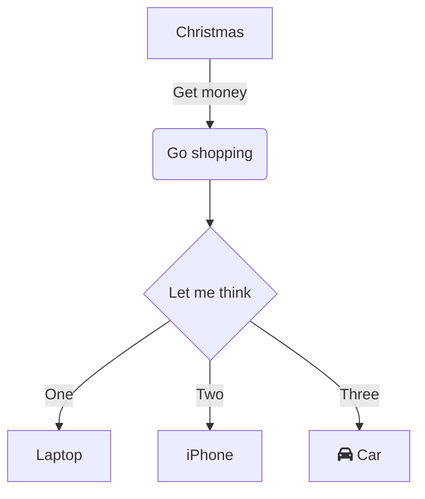

# Api Go

This project was develop in GoLand 2020.3 (Jetbrains)

## Prerequsites
Use Microsoft Terminal and check:

`go version`


GOROOT:

SDK Go Path

GOPATH:

Project Path


Build

`go build file.go`

Run

`go run file.go`

or

`./file`

Add Github Actions v5


```flow
st=>start: Start
op=>operation: Your Operation
cond=>condition: Yes or No?
e=>end

st->op->cond
cond(yes)->e
cond(no)->op
```
```sequence
participant C
participant B
participant A
Note right of A: By listing the participants\n you can change their order
```
