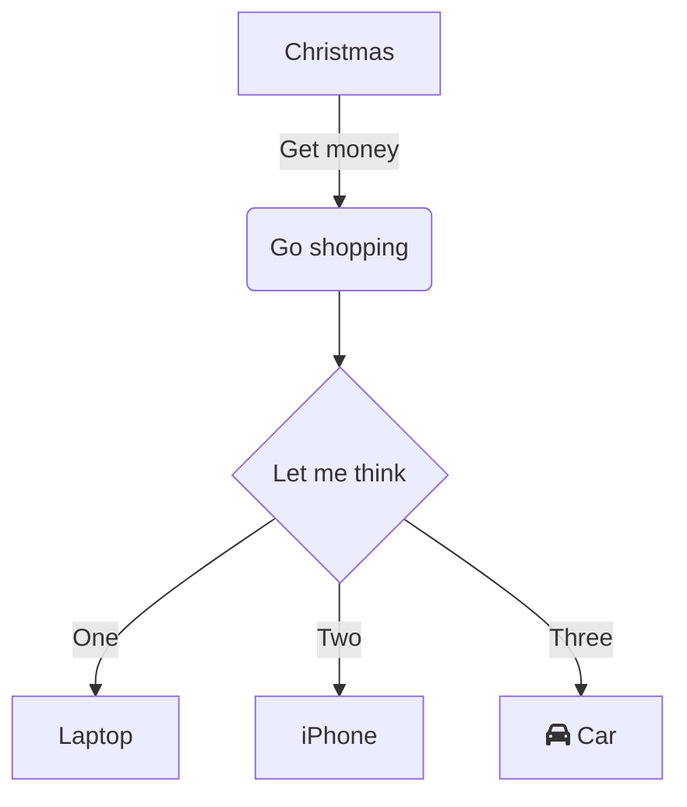
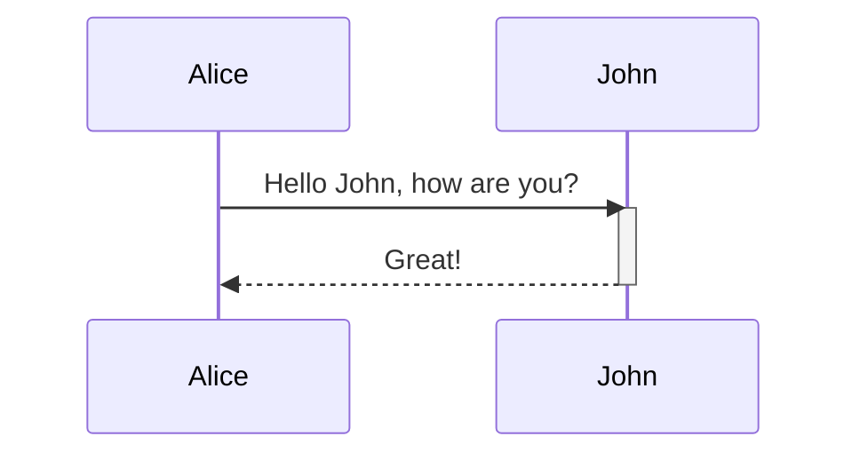

[](https://github.com/rafodelmal/go_api/actions/workflows/main_goapiapp.yml)
[](https://github.com/rafodelmal/go_api/actions/workflows/develop_go-api.yml)

# Api Go

This project was develop in GoLand 2020.3 (Jetbrains) the first commit, now are in 2022.2.2

## Prerequsites
Use Microsoft Terminal and check:

`go version`


GOROOT:

SDK Go Path

GOPATH:

Project Path


Build

`go build file.go`

Run

`go run file.go`

or

`./file`

Add Github Actions v5

<details>
  <summary>Diagrama 1</summary>



</details>
<!-- generated by mermaid compile action - END -->

```flow
st=>start: Start
op=>operation: Your Operation
cond=>condition: Yes or No?
e=>end

st->op->cond
cond(yes)->e
cond(no)->op
```
<details>
  <summary>Diagrama 2</summary>


</details>
